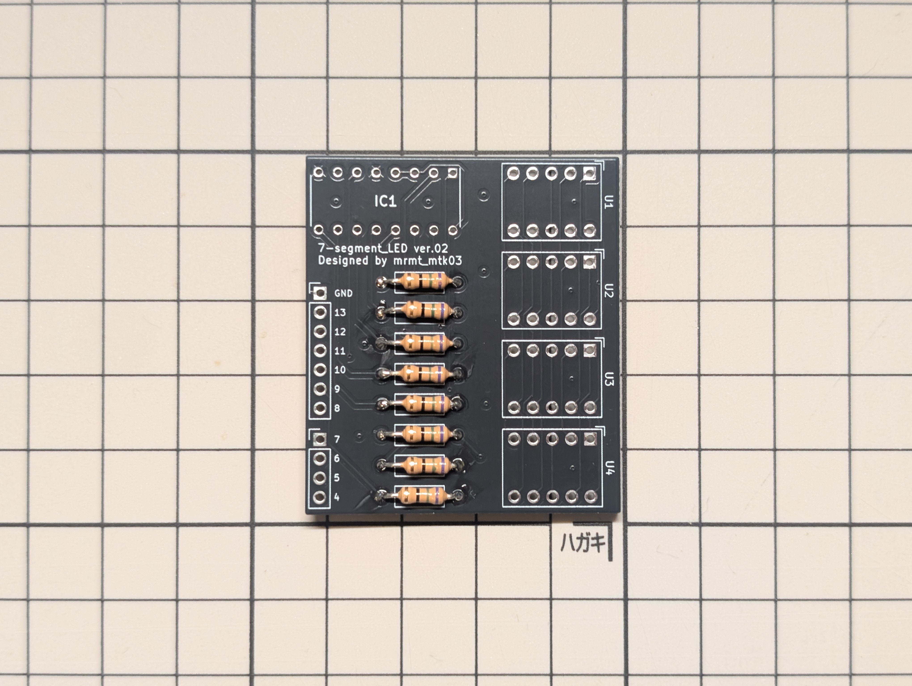
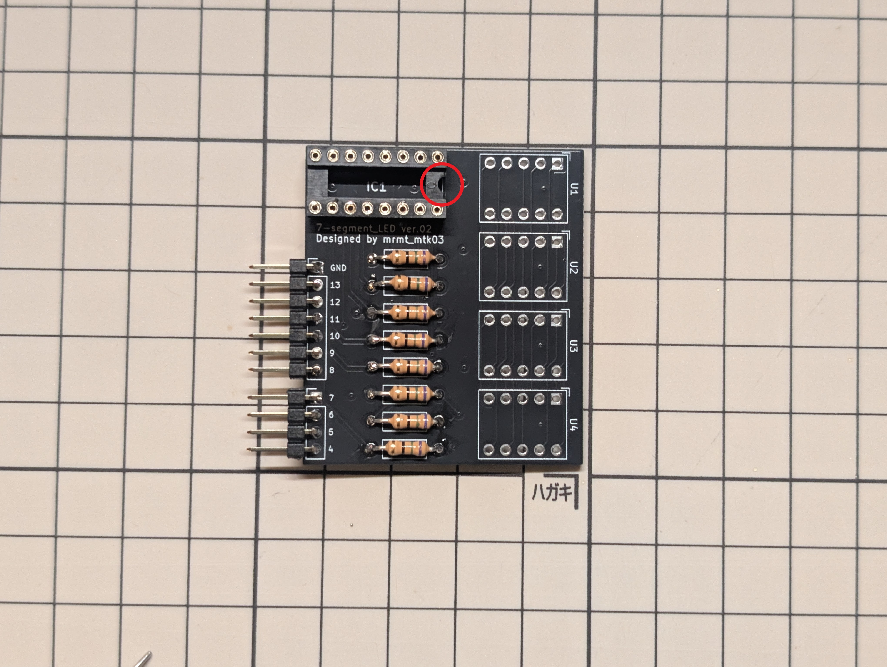
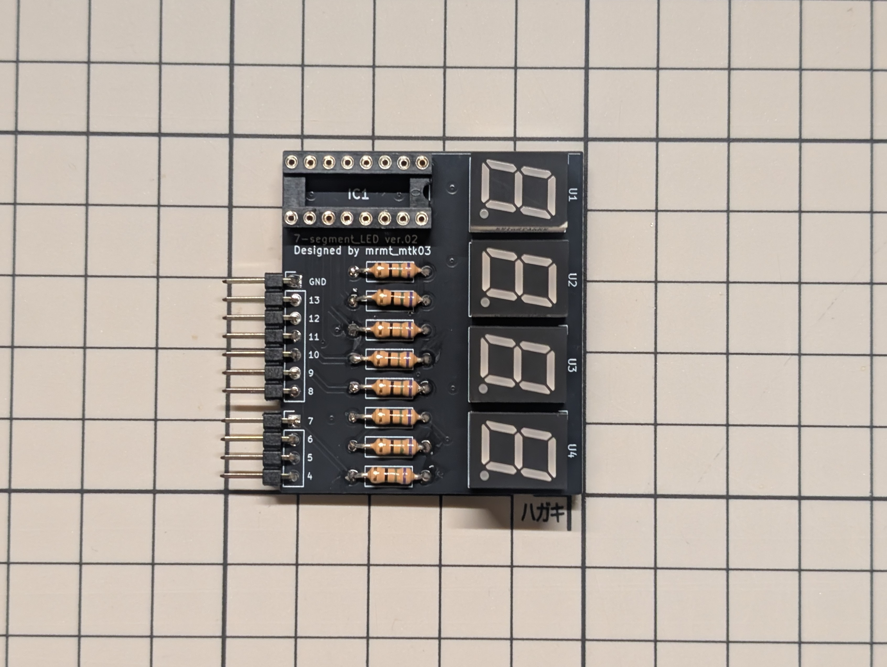
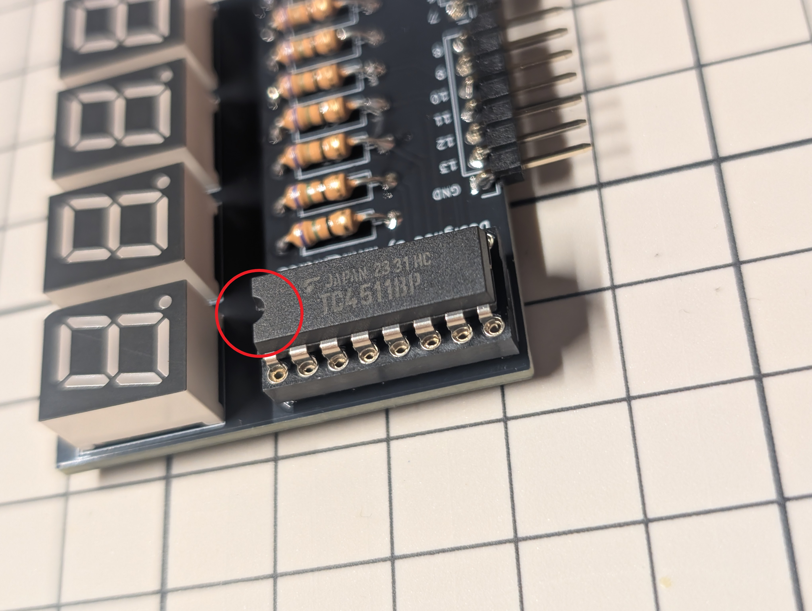
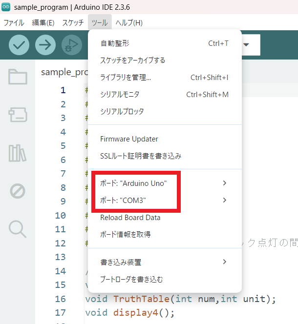
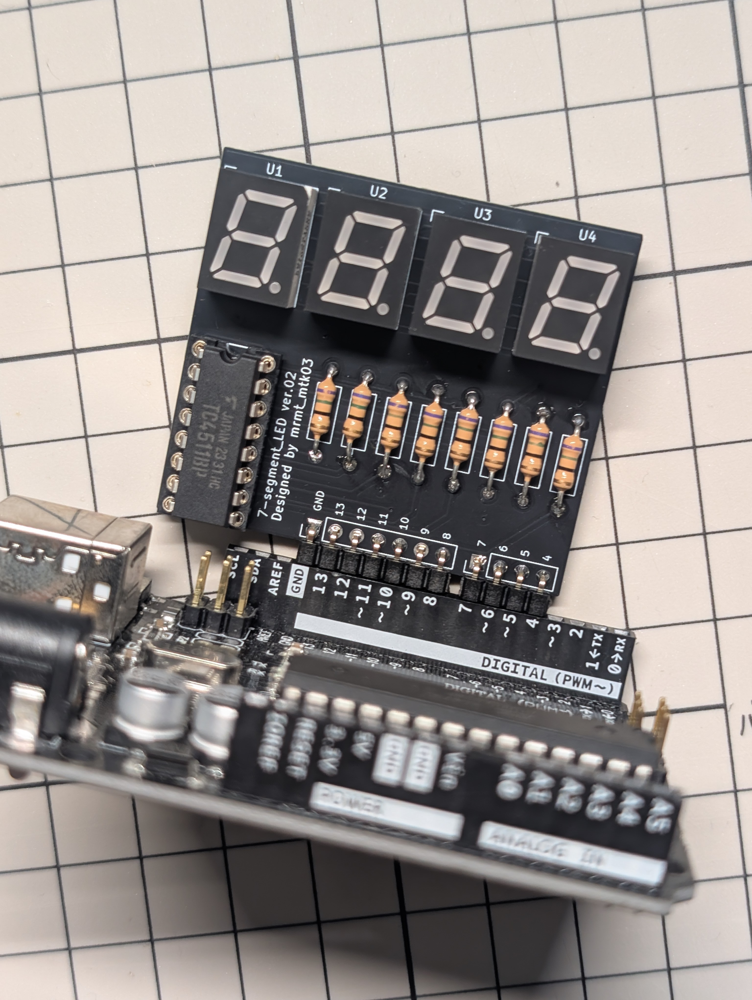

# How to Build
## 必要な工具
- はんだごて
- はんだ
- ニッパー
- Arduino UNO
## 必要な部品
まずは、必要部品を確認する。
|部品|型番|個数|
|:--|:--|--:|
|本体基板|-|1|
|7セグメントドライバー|TC4511BP|1|
|7セグメントLED|OSL10391-LRA|4|
|抵抗器|330 Ω (本資料では75 Ωを使用)|8|
|丸ピンICソケット(16P)|2227MC-16-03|1|
|L型ピンヘッダー 1×7|-|1|
|L型ピンヘッダー 1×4|-|1|
## 組み立て
初めに最も背の低い抵抗器を取り付ける。330 Ωの抵抗器のカラーコードは「橙橙茶金」である。

抵抗器は極性がないため、どちら向きに差し込んでも構わない。

抵抗器を差し込んで裏側からはんだ付けする。余った抵抗器の足はニッパーで切り落とす。

次にピンヘッダーをはんだ付けする。固定するのが難しい場合はマスキングテープなどで仮止めしてからはんだ付けすると良い。

このピンヘッダーを介してArduino UNOを接続することになる。

次にピンソケットをはんだ付けする。このときピンソケットにある切り欠き部分(赤丸)が右側に来るように取り付けると良い。

7セグメントLEDをはんだ付けする。上下の向きを間違えると点灯しないので画像の向きになるように設置する。

これもマスキングテープなどで仮止めするとはんだ付けしやすい。

最後にソケットに7セグメントドライバーIC(TC4511BP)を差し込む。

脚の間隔が合うように、少し指でICの脚を軽く曲げてやると差し込みやすい。

## 動作
動作させる場合は、まずArduino UNOにプログラムを書き込んでから本基板をArduinoと接続する。（Arduinoで何らかのプログラムが動作している可能性があり、本基板が破損するのを防ぐため）
### プログラムの書き込み
サンプルプログラムは [program_arduino](program_arduino)フォルダ に保存している。フォルダごとGithubからダウンロードして使用する。

ダウンロードしたプログラムファイルをArduino IDEで開き、手持ちのArduino UNOに書き込む。

書き込む際は「ツール」タブから「ボード:Arduino UNO」を選択し、ポートは適切なCOMポートになっていることを確認する。

### 基板の接続
正常に書き込みが完了したら、Arduinoと基板を接続する。

接続の際はデジタル入出力ピンの4番から13番およびその隣のGNDに基板のL型ピンヘッダが対応するように接続する。

## サンプルプログラム解説
作成予定